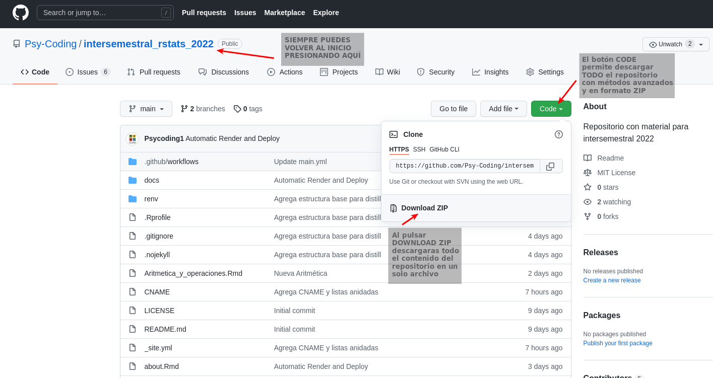

# Intersemestral Rstats 2022

Este repositorio contiene el material del curso intersemestral 2022. 
Tanto los ejercicios como el material necesario para la página del curso.

Si quieres utilizar algunos de los ejercicios del curso puedes descargar los archivos **Rmd** y abrirlos directamente
en tu computadora. Estos archivos tienen la ventaja de que se pueden ejecutar en cualquier equipo con Rstudio.

### ¿Como descargar?

Puedes descargar cualquier archivo del repositorio aunque para los fines del curso solo los archivos **Rmd** tiene
contenido del curso, código y figuras.

Para descargar archivos individuales debes:

1. Abrir el archivo Rmd con el nombre de la clase que buscas

    

2. Descargar enlace al que tenemos acceso mediante el boton RAW

    

Para descargar el repositorio puedes:

1. Presionar el botón **Code**
2. Seleccionar la opción `Download ZIP`
3. Descomprimir el archivo en tu equipo.

Cualquier duda por el **SLACK** y recuerda que todo el contenido se puede consultar en línea en la diercción
https://intersemestral.psycoding.org/
