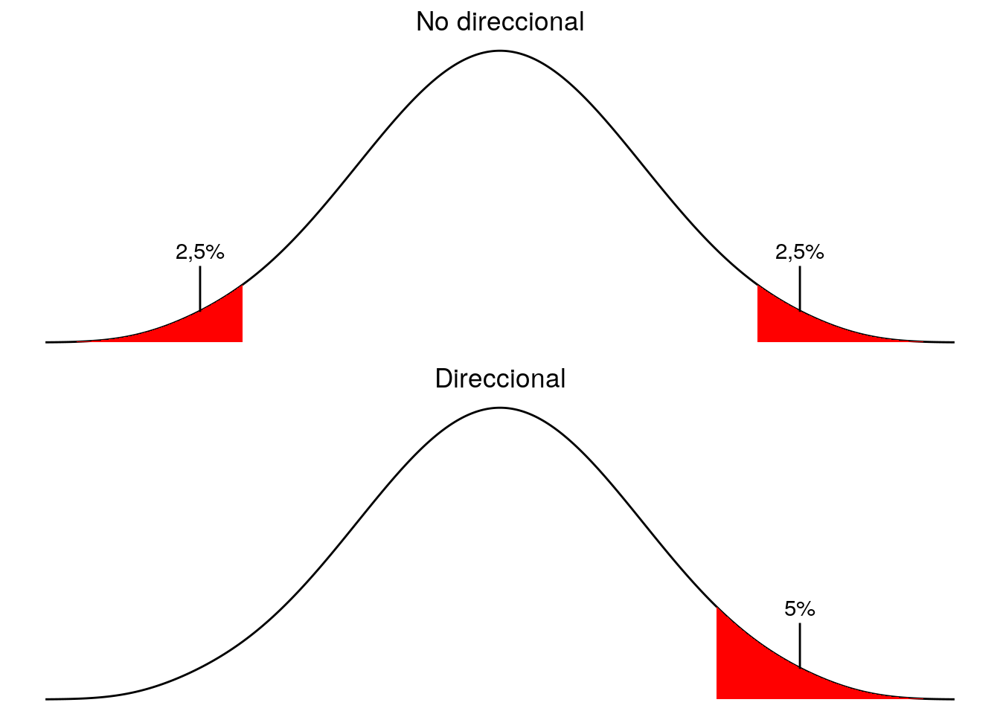

# Diseños experimentales comparativos y prueba de hipótesis 

En los experimentos cuyo diseño incluye a DOS grupos o condiciones experimentales para probar si existen diferencias entre ellos (grupos o condiciones).

Si son DOS grupos independientes, comparación entre muestras independientes. 
Si son DOS condiciones experimentales, comparación entre dos condiciones, la misma muestra.


### Plantear la hipótesis *nula*

**No existe diferencia entre la media de *una medida* entre los dos grupos**

#### Plantear alternativa | NO-direccional

H0 : µ1 = µ2

H1 : µ1 ≠ µ2


#### Plantear alternativas | Direccional

H0 : µ1 = µ2

H1 : µ1 > µ2 

o

H2 : µ1 < µ2


### Tipo de hipótesis alterna y nivel de significancia
{width=50% .external} 


Si nuestros datos cumplen con los criterios de la estadística paramétrica, podemos usar `t-test`

`t.test(x, y = NULL, alternative = c("two.sided", "less", "greater"), mu = 0, paired =
FALSE, var.equal = FALSE, conf.level = 0.95)`  


```{r, echo=FALSE}
library(dplyr)
set.seed(50)

BBC <- cbind(BBC_v = rnorm(80, 7.2, 1.1),
                     BBC_m = rnorm(80, 8.4, 1.8))
BBC <- as_tibble(BBC)
BBC <- BBC %>%  
  dplyr::filter(BBC_v <= 10, 
                BBC_m <= 10)
BBC <- cbind(BBC, id = c(1:63))
BBC <- as_tibble(BBC)
```

Tenemos las calificaciones de dos grupos de BBC, matutino y vespertino.

Revisa si son normales sus distrubuciones y si tienen homogeneidad de varianzas.

```{r}
shapiro.test(BBC$BBC_m)
shapiro.test(BBC$BBC_v)
var.test(x = BBC$BBC_m,
         y = BBC$BBC_v)
```


## One-t-test
Vamos a probar si la media de las calificaciones de BBC matutino (BBC_m) es igual a 10.

H0 : µ1 = 10

H1 : µ1 ≠ 10

```{r}
t.test(BBC$BBC_m, mu = 10)
```


## Two-t-test
Vamos a visualizar las distrubuciones de las dos poblaciones/grupos


```{r}
library(tidyr)
library(ggplot2)
library(forcats)
## custom colors
my_pal <- rcartocolor::carto_pal(n = 8, name = "Bold")[c(1, 3, 7, 2)]

q_pal <- colorspace::lighten(rcartocolor::carto_pal(
  n = 4, name = "Geyser")[c(2, 1, 4, 3)], .6)

theme_flip <- theme(
    axis.text.x = element_text(face = "plain", size = 22),
    axis.text.y = element_text(face = "bold", size = 26),
    panel.grid.major.x = element_line(color = "grey90", size = .6),
    panel.grid.major.y = element_blank(),
    legend.position = "top", 
    legend.text = element_text(size = 18),
    legend.title = element_text(face = "bold", size = 18, margin = margin(b = 25))
  )

BBC_l <- BBC %>% 
  pivot_longer(!id, names_to = "turno", values_to = "score") 
```


```{r, layout="l-body-outset", fig.width=6, fig.height=6}

ggplot(BBC_l, aes(score, fct_rev(turno), color = turno, fill = turno)) + 
  coord_cartesian(clip = "off") +
  scale_y_discrete(expand = c(.07, .07)) +
  scale_color_manual(values = my_pal, guide = "none") +
  scale_fill_manual(values = my_pal, guide = "none") +
  theme_flip + 
  labs(title = "Calificaciones BBC", x= "turno", y = " ") +
  ggridges::stat_density_ridges(
    aes(fill = factor(stat(quantile))),
    geom = "density_ridges_gradient", calc_ecdf = TRUE, quantiles = 4, 
    color = "black", size = 1) +
  scale_fill_manual(values = q_pal, name = "Quartile:") +
  guides(fill = guide_legend(override.aes = list(color = "transparent"))) +
  theme_minimal() +
  theme(plot.title = element_text(size = 20, face = "bold"),
        axis.title.y = element_text(size = 18, face="bold"),
        axis.title.x = element_text(size = 18, face="bold"),
        axis.text = element_text(size = 10, face="bold")) 
```


## ¿hay diferencias en las calificaciones entre los dos turnos?

H0 : µ1 = µ2

H1 : µ1 ≠ µ2

## ¿cómo lo probarían?


## ¿El turno matutino obtuvó `mayores` calificaciones que el del turno vespertino?

H0 : µ1 = µ2

H1 : µ1 > µ2

```{r}
t.test(BBC$BBC_m, BBC$BBC_v, alternative =  "greater", var.equal = FALSE)
```


# No-Paramétrica: Prueba U de Mann-Whitney para muestras independientes

La prueba se basa en una comparación de cada observación de una muestra xi con cada observación en la segunda muestra yj. Si las muestras tienen la misma **mediana**, entones cada observación tiene un 0,5 (50%) de probabilidad de ser mayor o menor que la observación correspondiente de la otra muestra. Por tanto plantean las hipótesis:

H0 : (xi > yj) = 1/2

H1 : (xi > µ2) ≠ 1/2

Si nuestros datos de la BBC no cumplieran alguún criterio de la estadística paramétrica.

```{r}
wilcox.test(BBC$BBC_m, BBC$BBC_v)
```

Con el dataset `sleep`

```{r}
wilcox.test(sleep$extra ~ sleep$group)
```


# No-Paramétrica: Prueba Wilcox para muestras dependientes

Un grupo de doce pacientes con dolor crónico y les damos dos medicaciones distintas para aliviar los síntomas. Pedimos a todos que nos indiquen cuantas horas de alivio observaron con ambas drogas.

```{r}
df_dolor <- cbind(
  Paciente = c( 1, 2, 3, 4, 5, 6, 7, 8, 9, 10, 11, 12),
  Droga.A = c( 2,  3.6,  2.6,  2.7,  7.3,  3.4,  14.9,  6.6,  2.3,  2.1,  6.8,  8.5),
  Droga.B = c( 3.5,  5.7,  2.9,  2.4,  9.9,  3.3,  16.7,  6,  3.8,  4,  9.1,  20.9)
)

df_dolor <- as_tibble(df_dolor)
```


Hacemos el test

```{r}
wilcox.test(df_dolor$Droga.A, df_dolor$Droga.B, paired = TRUE)
```


# Comparación entre más de dos grupos paramétrica

ANOVA - una vía-factor

ANOVA FACTORIAL


Kruskal-Wallis

Friedman test


