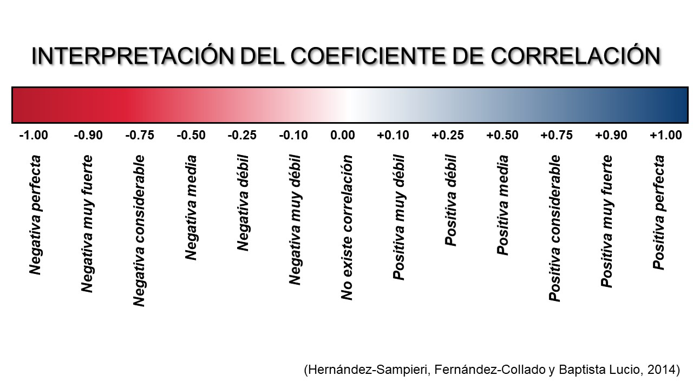

```{r setup, include=FALSE}
knitr::opts_chunk$set(echo = TRUE)
```

# Correlación

Su finalidad es conocer la relación o grado de asociación que existe entre dos o más conceptos, categorías o variables en una muestra o contexto particular.


Las variables NO son variable independiente (causa) y dependiente(efecto) en la correlación. 

¿Por qué?
Porque una correlación fuerte entre dos variables no significa que una de ellas sea la causa de la otra.


## Hipótesis en la correlación

### Hipótesis estadísticas

H0: No existe una relación estadísticamente significativa entre las variables.

H1: Existe una relación estadísticamente significativa entre las variables.

### Hipótesis de trabajo

Plantean que existe relación entre dos o más variables y puede ser que se especifique cómo están asociadas:

* Existe una relación entre el nivel socioeconómico y la calidad de vida.
* A mayor nivel socioeconómico, mayor calidad de vida.
* A mayor nivel socioeconómico, menor calidad de vida.

Se debe tomar en cuenta que en una hipótesis de correlación NO es importante en qué orden coloquemos las variables, ya que no hay relación de causalidad. 

cuando X es mayor, Y es mayor = cuando Y es mayor, X es mayor
cuando X es mayor, Y es menor = cuando Y es menor, X es mayor

## Pruebas de hipótesis: Los coeficientes de correlación 
Expresan cuantitativamente la **magnitud** y **dirección** de la relación entre dos variables.  
* Magnitud: 0-1
* Dirección: Negativa-Positiva



* Correlación negativa perfecta: cada vez que X aumenta una unidad, Y disminuye siempre una cantidad constante
* Correlación positiva perfecta: cada vez que X aumenta una unidad, Y aumenta siempre una cantidad constante

Vamos a trabajar con los datos de [ABIDE.](http://fcon_1000.projects.nitrc.org/indi/abide/) Para esto primero vamos a leer el archivo csv y explorarlo.

```{r}
BD_ABIDE<-read.csv("./datos/Phenotypic_V1_0b.csv")
```

Veamos las variables que contiene:
```{r}
names(BD_ABIDE)
```

Seleccionemos ahora los datos con los que nos interesa trabajar, para ello usaremos funciones de dplyr:
```{r message=FALSE, warning=FALSE}
library(dplyr)
BD<-BD_ABIDE %>% 
  select(SITE_ID,DX_GROUP,SRS_RAW_TOTAL,VIQ,AGE_AT_SCAN) %>% filter(SITE_ID=="YALE",SRS_RAW_TOTAL!=-9999) 
#Se eliminan valores NA codificados como -9999 en esta base de datos
```
Ahora veamos la estructura general de los datos con los que vamos a trabajar
```{r}
str(BD)
```

Aquí, la variable DX_GROUP se toma como íntegro, pero realmente debería ser un factor de 2 niveles (1= Trastorno del Espectro Autista, 2= Desarrollo Típico):

```{r}
BD$DX_GROUP<- factor(BD$DX_GROUP, levels = c("1","2"),
                  labels = c("TEA","DT"))
```

Veamos los descriptivos de la muestra:
```{r}
BD %>%
  group_by(DX_GROUP) %>% 
  summarise(
    n=n(),
    media_edad=mean(AGE_AT_SCAN),
    ds_edad=sd(AGE_AT_SCAN),
    min_edad=min(AGE_AT_SCAN),
    max_edad=max(AGE_AT_SCAN),
    media_SRS=mean(SRS_RAW_TOTAL),
    ds_SRS=sd(SRS_RAW_TOTAL),
    min_SRS=min(SRS_RAW_TOTAL),
    max_SRS=max(SRS_RAW_TOTAL),
    media_VIQ=mean(VIQ),
    ds_VIQ=sd(VIQ),
    min_VIQ=min(VIQ),
    max_VIQ=max(VIQ),
    
  )
  
```


## Visualización en Scatter plots (diagramas de dispersión)

Podemos darnos una idea de cómo es la relación entre dos variables usando los digramas de dispersión. En esta clase de visualización se grafica un punto en la coordenada donde interseccionan el valor de una variable X y el valor de una variable Y.


Cuanto más cercanos son los puntos a una línea modelada, mayor es la magnitud del coeficiente de correlación.  

Vamos a visualizar nuestras variables
```{r}
library(ggplot2)
ggplot(BD, aes(x=SRS_RAW_TOTAL, y=VIQ, color=DX_GROUP)) + 
    geom_point(size=4) +
    labs(
        color ="Grupo",
        x="Puntaje SRS",
        y="VIQ"
    )+
    theme_minimal()
```
```{r}
ggplot(BD, aes(x=SRS_RAW_TOTAL, y=VIQ, color=AGE_AT_SCAN)) + 
    geom_point(size=4) +
    labs(
        color ="Edad",
        x="Puntaje SRS",
        y="VIQ"
    )+
    theme_minimal()
```
## Calculando los coeficientes

* Coeficiente de correlación de Pearson (r) o coeficiente producto-momento. 

Es una prueba paramétrica usada para analizar la relación entre dos variables medidas en un nivel de intervalos o razón (variables cuantitativas continuas). 
```{r}
cor.test(BD$SRS_RAW_TOTAL,BD$VIQ)
```
Aquí, el valor de cor indica la magnitud y la dirección de la correlación. El p-value nos indica si los resultados caen dentro de la zona de rechazo o la zona de aceptación de la hipótesis nula. 


En general, en psicología suele asumirse un riesgo de 5% de concluir que existe un efecto cuando en realidad no lo hay (rechazar la hipótesis nula y quedarnos con la alternativa), por lo cual un p-value<0.05 implica que existe una relación estadísticamente significativa. 

Una diferencia **estadísticamente significativa** solamente significa que existe evidencia estadística de que hay una relación. NO significa que la diferencia sea grande, importante o radicalmente diferente; para conocer la magnitud de la correlación recurrimos al coeficiente (cor).

* Coeficiente de correlación de Spearman (ρ), correlación de grados/rangos ordenados o Rho (ρ) de Spearman. 

Es la alternativa no paramétrica de la correlación de Pearson, sin embargo es aplicable cuando las mediciones se realizan en una escala ordinal, aprovechando la clasificación por rangos. 

```{r}
cor.test(BD$SRS_RAW_TOTAL,BD$VIQ, method = "spearman")

```
## Matrices de correlación

Permiten identificar visualmente el valor de múltiples coeficientes de correlación y la dirección de las relaciones.


* [Aquí](http://www.sthda.com/english/wiki/visualize-correlation-matrix-using-correlogram) un tutorial para hacer matrices de correlación con la libreria **corrplot.** 
* [Aquí](https://r-coder.com/grafico-correlacion-r/#Graficos_de_correlacion_en_R_con_el_paquete_psych) un tutorial para hacer matrices de correlación con la libreria **psych.**
* [Aquí](https://r-charts.com/correlation/) hay múltiples tutoriales útiles para graficar correlaciones. 

# Regresión lineal 

Es un modelo estadístico que brinda la oportunidad de predecir las puntuaciones de una variable a partir de las puntuaciones de otra (estimar el efecto de una sobre otra)

Está asociado con el coeficiente de correlación de Pearson, pues a mayor magnitud del coeficiente se tiene mayor capacidad de predicción. 

A diferencia de la correlación, sí se considera a una variable como dependiente y la otra independiente. 

Trabaja con variables en nivel de medición de intervalos o razón. 

# Recta de regresión

La regresión lineal consiste en modelar la ecuación de una recta que pueda resumir el diagrama de dispersión. La ecuación modelada es:

Y' = B0 + B1*x'

Donde:

- **Y'** es un valor de la variable dependiente que se desea predecir
- **B0** es el intercepto (valor que toma Y cuando X vale 0)
- **B1** es la pendiente o inclinación de la recta. Para interpretar la pendiente se dice que: por cada unidad adicional en x, la variable Y aumenta **B1** unidades.  
- **x'** es el valor nuevo que se asigna a la variable independiente o predictora.  


B0 y B1 son coeficientes **constantes** que se obtienen al modelar la línea que mejor se ajusta a los datos. Tanto Y' como x' van cambiando, pues la nueva entrada da otro valor al realizar las operaciones de la ecuación. 


# Comandos en R

Con el comando **lm(variable dependiente~predictor1, data = mis_datos)** generemos un objeto donde se almacena la información del modelo. 
```{r}
modelo_simple <- lm(SRS_RAW_TOTAL ~ VIQ, data = BD)
#modelo_multiple <- lm(SRS_RAW_TOTAL ~ VIQ+ AGE_AT_SCAN, data = BD)
modelo_simple

```

* Intercepto: El valor promedio del puntaje de la SRS cuando el coeficiente intelectual verbal vale 0 es de 107.2495 unidades. 

* Pendiente (predictor disp): Por cada unidad que se incrementa en el predictor VIQ, el puntaje de la SRS disminuye en promedio 0.4741 unidades.


Para conocer el contenido del objeto: 
```{r}
names(modelo_simple)

```

Para visualizar los principales parámetros del modelo:
```{r}
summary(modelo_simple)
```

Se observa que el p-value del estadístico F es mayor a .05 (0.108640) , lo cual indica que el predictor del modelo no está significativamente relacionado con la variable dependiente. 

Acorde a lo obtenido en multiple R-squared, el VIQ es capaz de explicar el 05.06% de la variabilidad observada en los puntajes totales de la SRS. 


# Gráfico de dispersión con la recta de regresión 

```{r message=FALSE, warning=FALSE}
#plot(BD$VIQ,BD$SRS_RAW_TOTAL)
#abline(modelo_simple, col = "red")

ggplot(data = BD, aes(x = VIQ, y = SRS_RAW_TOTAL)) + 
  geom_point(color='blue') +
  geom_smooth(method = "lm", se = FALSE)+
  labs(
    x="Coeficiente intelectual verbal",
    y="Escala de sensibilidad social (Total)"
  )
```

# Regresión logística
Al igual que la regresión lineal permite predecir la variable dependiente a partir de la independiente. Sin embargo, la variable dependiente (VD) NO es cuantitativa, es categórica.

- Regresión logística binomial: La VD toma dos valores (0 y 1) dependiendo de si el individuo tiene una característica (1) o no (0).

- [Regresión logística multinomial](https://rpubs.com/jaimeisaacp/789806#:~:text=La%20regresi%C3%B3n%20multinomial%20es%20una,una%20o%20m%C3%A1s%20variables%20independientes.): La VD tiene más de dos categorías. 

# Regresión logística binomial

**Es un modelo de predicción de probabilidad de ocurrencia de una variable dicotómica categórica**

Permite responder a la pregunta ¿qué tan probable es que ocurra una categoría determinada de la variable dependiente cuando se presenta cierto valor o cierta categoría en la(s) variable(s) independiente(s)?

Es decir, las variables independientes pueden ser tanto numéricas como categóricas.

Una de las principales aplicaciones de la regresión logística es la de clasificación binaria, en el que las observaciones se clasifican en un grupo u otro dependiendo del valor que tome la variable empleada como predictor. Por ejemplo, clasificar a una mujer como infertil o no en función de la edad, el número de abortos inducidos y espontáneos previos, información que se encuentra disponible en la base *infert.*

```{r}
head(infert)
#help(infert)
```


El diagrama de dispersión de dos variables categóricas no brinda mucha información, pues los datos de todas las participantes se agrupan en alguna de las 3 categorías de la variable **induced** y en alguno de las dos de la variable **case**.

```{r}
infertilidad <- infert
plot(infertilidad$induced, infert$case)
```

# NO hay linealidad en los datos

```{r}
plot(infert$age, infert$case)
```

El diagrama de dispersión muestra dos líneas de datos agrupados de acuerdo con las categorías de la variable dependiente, por lo que no se cumple el supuesto de linealidad (los datos no se pueden representar con una línea recta). Esto es importante, ya que para cumplir este supuesto, internamente el modelo hace una transformación logarítmica de los datos. 

```{r}
modelo_logistica <- glm(
  case ~ age + induced + spontaneous, 
  data = infertilidad, family = binomial)
summary(modelo_logistica)
```

# Interpretación de los coeficientes del modelo

Los coeficientes miden el impacto en el logaritmo de la probabilidad. Para quitar el logaritmo se saca el exponencial de los coeficientes. 

```{r}
exp(coefficients(modelo_logistica))
```
Se interpretan sólo los predictores que fueron significativos en el summary:

- **Induced**  Por cada aborto inducido que se aumenta, la probabilidad de que la mujer sea infértil incrementa 1.54 unidades.
- **Spontaneous** Por cada aborto espontáneo que se aumenta, la probabilidad de que la mujer sea infértil incrementa 3.36 unidades. 
