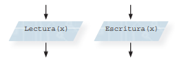

```{r setup, include=FALSE}
knitr::opts_chunk$set(echo = TRUE)
```

## Introducción a la Programación 

Las computadoras ejecutan órdenes en un formato que les es entendible, estas órdenes se agrupan en lo que nosotros 
conocemos como un programa, o  software, el cual se divide en dos partes dependiendo de su formato:

* siendo uno el de representación interna de los programas, lenguaje máquina o código ejecutable;

* y el de presentación externa, archivo o un conjunto de archivos que puede o no estar en un formato que pueda ser visto
o leído por el usuario (formato que respeta reglas). 


Este conjunto de instrucciones partirá de un estado inicial a un estado final, o en otras palabras de un problema 
inicial a su resolución. Cuando se tienen estas problemáticas se usan estos programas para hallar la solución y muchas
veces ya hay en existencia software que cumplen con distintos objetivos así que solo sería cuestión de tomar el que te
funcione, pero en ocasiones estos pueden no acoplarse a tu situación específica por lo que se puede elaborar uno propio 
y así realizar la **programación** para la resolución desde tu situación inicial, pero se debe de comprender que
**no es solo el realizar código, sino que hay más trabajo detrás** para que lo que se pretende crear sea funcional
dependiendo de tus objetivos. 

Se debe de conocer mucha información para llegar a estos planteamientos como lo serían: transformar el problema inicial
en un algoritmo, representación gráfica por medio de diagrama de flujo, introducir el lenguaje con pseudocódigo y por
último realizar el programa.

### Algoritmos

Un algoritmo constituye una lista bien **definida, ordenada y finita de operaciones** que nos permitirá encontrar
solución al problema comenzando desde su estado inicial hasta el estado final. Para describir los algoritmos usualmente
de realiza en tres niveles:

1. nivel alto,
2. formal y 
3. de implementación. 


*Las etapas de desarrollo de un algoritmo con base lógica:*

Primero se deberá de **definir** el propósito, el problema que se quiere resolver y lo que pretende lograr con 
su solución, para luego **analizar** el problema y sus características para determinar sus entradas y salidas; y ver si
ya existen soluciones al problema. A continuación, se deberá de **diseñar** el planteamiento de la solución donde se
puedan usar diagramas de flujo y pseudocódigo. Ya como último paso es la **implementación** donde se realiza o se ve
ya concretado el programa.

### Diagramas de Flujo

Son utilizados para poder **ordenar los pasos que a seguir**, o acciones a realizar, presentado la información de
manera clara **sin necesidad de conocimientos mayores de programación.**
Estos diagramas se leen de arriba a abajo y están compuestos por **bloques que son conectados a través de flechas** que
darán sentido. 

* Un bloque específico para el inicio y el final.


* Para las operaciones de entrada o salida se usan paralelogramos.
  



* Para hacer asignaciones serán rectangulares o cuadrados. 


* Una decisión con base en una expresión lógica se usará un bloque en forma de rombo.


### Pseudocódigo

El pseudocódigo, o falso lenguaje, estará compuesto por palabras con un cierto formalismo con los cuales se pretende
**describir el funcionamiento de un programa.** Se utiliza tanto lenguaje común como instrucciones de programación para
la explicación de estructuras básicas para que el programador pueda focalizarse en los 
**aspectos lógicos de la solución del problema.** 

Para describir las instrucciones de los algoritmos se usarán en el pseudocódigo las estructuras de control; 
las cuales son cuatro:

* **Secuencial**

  + Instrucciones que se ejecutan en el orden indicado por los índices: de arriba abajo, una después de la otra.

* **Selectiva**

  + Expresan las elecciones que se hacen durante el proceso de resolución del problema
  
    + Selectiva simple: Al realizar el cálculo lógico solo se ejecutarán las instrucciones si el resultado es verdadero.
    Palabras clave: si, entonces y fin sí. 
    
    + Selectiva doble (alternativa): Al realizar el cálculo de la expresión lógica tanto para el resultado falso como el
    verdadero se ejecutarán instrucciones.
    
    + Selectiva múltiple: Anidar condiciones lógicas mutuamente excluyentes. 
    
    + Selectiva casos (múltiple): Cuando el mismo valor se compara con varios valores. A un valor se le compara con los
    existentes donde si hay un valor igual se aplicarán instrucciones, pero si no es así se aplican las instrucciones diferentes.

* **Iterativa**

  + El ejecutar un grupo de instrucciones más de una vez así se podrán ejecutar varias veces una misma parte del código.
  Ejemplos serían:
  
    + Estructura iterativa mientras (while).
    
    + Estructura iterativa repetir (repeat).
    
    + Estructura iterativa para (for).
    
* **Anidamiento**
  
  + Una iterativa en otra.


> Referencias

Juganaru, M. M. (2014). *Introducción a la programación.* Grupo Editorial Patria.

Psycoding. (27 de mayo 2020). *Videos* [Página de Facebook]. Facebook. Recuperado el 11 de diciembre de 2021 de https://www.facebook.com/108380504188578/videos/614401312494378 

--
