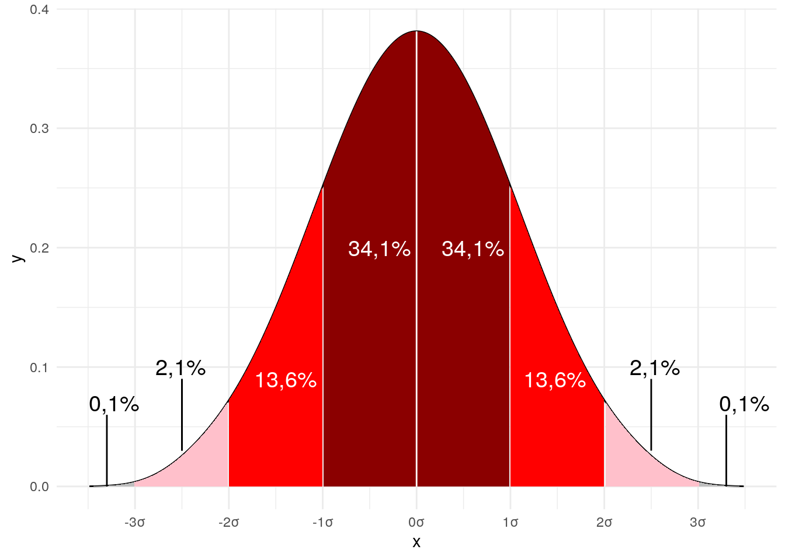

```{r setup, include=FALSE}
knitr::opts_chunk$set(echo = FALSE)
```


# Estadística aplicada de acuerdo a tres criterios:

### por su alcance u objetivos del análisis

- Descriptiva 
- Inferencial

### por su relación entre variables y número de variables

- Univariada
- Bivariada
- Multivariada

### por las características de las variables (datos)

- Paramétrica
- No-Paramétrica 


## Criterios para decidir las estrategías estadísticas

1. Cuál es el objetivo de la investigación?

2. Cuál es el nivel de medición de las variables?

3. Cuál fue la estrategía de muestreo empleada?


# Premisas para usar estadística paramétrica

## 1. Las observaciones deben ser independiente | muestreo probabilístico.

#### Probabilístico
{width=50% .external}  

#### NO-Probabilístico
{width=50% .external} 


## 2. Las variables deben ser medidas por lo menos en escala de intervalo, para las operaciones aritméticas.

#### Niveles de medición
{width=70% .external} 

## 3. Las poblaciones deben provenir de universos cuya distribución siga una **curva normal**.

- Muchos fenómenos que podemos medir tanto en las ciencias exactas como las sociales de asemejan en su frecuencia a esta distribución.

- La distribución normal tiene ciertas propiedades matemáticas que nos permiten predecir qué proporción de la población (estadística) caerá dentro de cierto rango si la variable tiene distribución normal, **media y desviación estándar**

- Varios tests de significancia de diferencia entre conjuntos/grupos de datos asumen que los datos del tienen una distribución normal.

#### curva normal
{width=60% .external}

#### Vamos a hacer una prueba en R con los datos *iris*


```{r}
library(tidyverse)
library(forcats)
```


```{r}
## custom colors
my_pal <- rcartocolor::carto_pal(n = 8, name = "Bold")[c(1, 3, 7, 2)]

q_pal <- colorspace::lighten(rcartocolor::carto_pal(
  n = 4, name = "Geyser")[c(2, 1, 4, 3)], .6)

theme_flip <- theme(
    axis.text.x = element_text(face = "plain", size = 22),
    axis.text.y = element_text(face = "bold", size = 26),
    panel.grid.major.x = element_line(color = "grey90", size = .6),
    panel.grid.major.y = element_blank(),
    legend.position = "top", 
    legend.text = element_text(size = 18),
    legend.title = element_text(face = "bold", size = 18, margin = margin(b = 25))
  )

iris_l <- iris %>% 
  pivot_longer(!Species, names_to = "caracteristica", values_to = "score") 
```


```{r, layout="l-body-outset", fig.width=6, fig.height=6}
ggplot(iris_l, aes(score, fct_rev(caracteristica), color = caracteristica, fill = caracteristica)) + 
  coord_cartesian(clip = "off") +
  scale_y_discrete(expand = c(.07, .07)) +
  scale_color_manual(values = my_pal, guide = "none") +
  scale_fill_manual(values = my_pal, guide = "none") +
  theme_flip + 
  labs(title = "características de la flor", x= "tamaño", y = " ") +
  ggridges::stat_density_ridges(
    aes(fill = factor(stat(quantile))),
    geom = "density_ridges_gradient", calc_ecdf = TRUE, quantiles = 4, 
    color = "black", size = 1) +
  scale_fill_manual(values = q_pal, name = "Quartile:") +
  guides(fill = guide_legend(override.aes = list(color = "transparent"))) +
  theme_minimal() +
  theme(plot.title = element_text(size = 20, face = "bold"),
        axis.title.y = element_text(size = 18, face="bold"),
        axis.title.x = element_text(size = 18, face="bold"),
        axis.text = element_text(size = 10, face="bold")) 
```


Calcular la cantidad de datos dentro de las dos primeras desviaciones

```{r, echo=TRUE}
sum( 
    iris$Sepal.Width <  mean(iris$Sepal.Width) + sd(iris$Sepal.Width) 
    &
    iris$Sepal.Width > mean(iris$Sepal.Width) - sd(iris$Sepal.Width) 
)/nrow(iris)
```


##### ... o bien, podemos usar pruebas estadísticas para averiguar si los datos siguen una distribución de la curva normal

Prueba de Hipótesis:
H0 = no diferencias con la curva normal
Ha = diferencias con la curva normal

```{r}
shapiro.test(iris$Petal.Length)
shapiro.test(iris$Petal.Width)
shapiro.test(iris$Sepal.Length)
shapiro.test(iris$Sepal.Width)
```

##### ... otras opciones 

```{r}
tseries::jarque.bera.test(iris$Sepal.Width)
tseries::jarque.bera.test(iris$Sepal.Length)
tseries::jarque.bera.test(iris$Petal.Width)
tseries::jarque.bera.test(iris$Petal.Length)
```

##### ... otras, las de la libraría `nortest`

nortest::ad.test(data)

nortest::cvm.test(data)

nortest::lillie.test(data)

nortest::pearson.test(data)

nortest::sf.test(data)


## 4. Las poblaciones deben tener la misma varianza, aunque es suficiente con saber la tasa de sus varianzas.

La varianza es una medida de dispersión que representa la variabilidad de una serie de datos respecto a su media. Formalmente se calcula como la suma de los residuos al cuadrado divididos entre el total [-1] de observaciones.


$$
\sigma^2 = \frac{\sum(x_i -\mu)^2}{n - 1} 
$$


El cumplimiento del supuesto de varianza constante se conoce como *homocedasticidad* y el incumplimiento como *heterocedasticidad*.

{width=60% .external}

Prueba de Hipótesis:
H0 = no diferencias en las varianzas | *homocedasticidad*
Ha = diferencias en las varianzas | *heterocedasticidad*


```{r, echo=TRUE}
aggregate(Petal.Length ~ Species, data = iris, FUN = var)
```


```{r}
iris_v <- filter(.data = iris, Species %in% c("versicolor", "virginica"))

ggplot(data = iris_v, aes(x = Species, y = Petal.Length, colour = Species)) +
  geom_boxplot() +
  geom_point() +
  theme_bw() +
  theme(legend.position = "none")
```


```{r, echo=TRUE}
aggregate(Petal.Length ~ Species, data = iris_v, FUN = var)
```

### F-test (razón de varianzas)
Para distribuciones *normales*, dos poblaciones

```{r}
var.test(x = iris[iris$Species == "versicolor", "Petal.Length"],
         y = iris[iris$Species == "virginica", "Petal.Length"] )
```


### Levene
Se caracteriza, además de por poder comparar 2 o más poblaciones, por permitir elegir entre diferentes estadísticos de centralidad :mediana (por defecto), media, media truncada. Esto es importante a la hora de contrastar la homocedasticidad dependiendo de si los grupos se distribuyen de forma normal o no.

```{r}
library(car)
leveneTest(y = iris$Petal.Length, group = iris$Species, center = "median")
```


### Bartlett
Permite contrastar la igualdad de varianza en 2 o más poblaciones sin necesidad de que el tamaño de los grupos sea el mismo, pero es mejor para distribuciones *normales*.

```{r}
a <- iris[iris$Species == "versicolor", "Petal.Length"]
b <- iris[iris$Species == "virginica", "Petal.Length"]
bartlett.test(list(a,b))


bartlett.test(iris$Sepal.Length ~ iris$Species)
```


### Test de Brown-Forsyth

Es equivalente al test de Levene cuando se emplea la mediana como medida de centralidad.

```{r}
library(HH)
hov(iris$Sepal.Length ~ iris$Species)
```


### Test de Fligner-Killeen

Se trata de un test no paramétrico que compara las varianzas basándose en la mediana. Es también una alternativa cuando no se cumple la condición de normalidad en las muestras.

```{r}
a <- iris[iris$Species == "versicolor","Petal.Length"]
b <- iris[iris$Species == "virginica","Petal.Length"]
fligner.test(x = list(a,b))
```


## EXTRA
##### Calculo de los residuales con lm y probar la prueba `Breush-Pagan`o `Durbin-Watson` 
library(lmtest)

`bptest(LM)`

##### Métodos de corrección de la varianza no constante 
Corregir la no linealidad 
Corregir las observaciones influyentes
Mínimos cuadrados ponderados 

